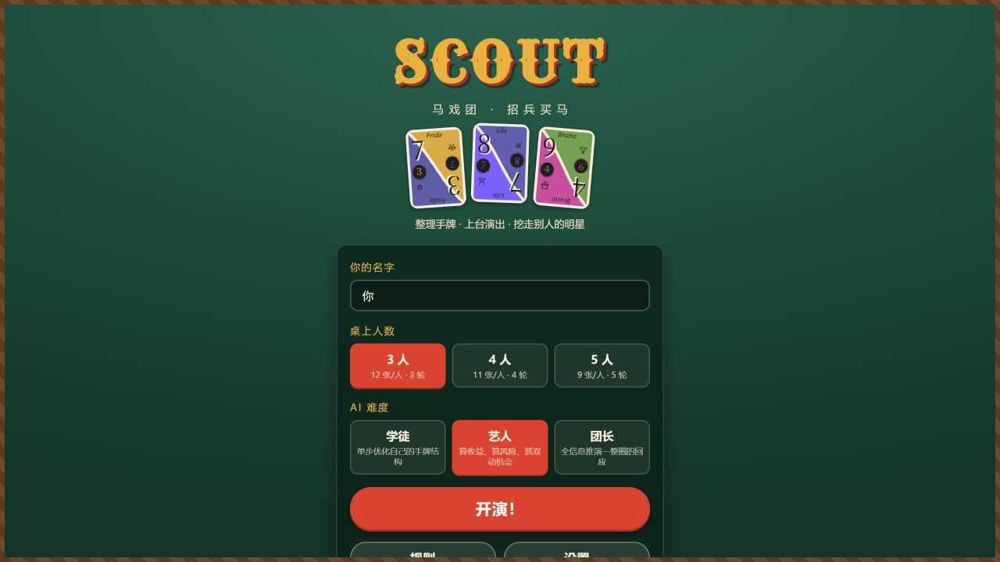
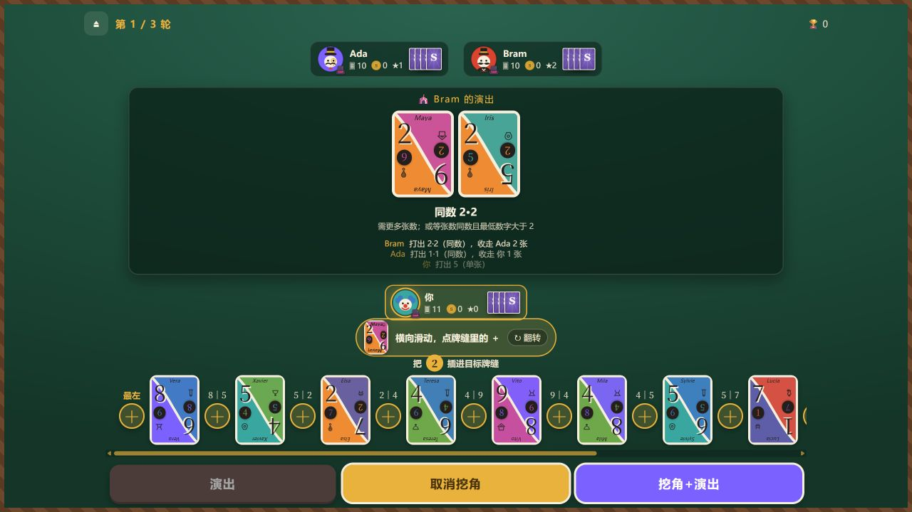

<div align="center">

# SCOUT · 马戏团

**面向中文玩家的 SCOUT 单机 PWA：1 名玩家对战 2–4 名 AI。**

[在线试玩（Cloudflare）](https://myscout.pages.dev/) · [GitHub Pages](https://czm-mmm.github.io/vibeidea/) · [玩法与设计](docs/单机版设计.md)

[](https://github.com/czm-mmm/vibeidea/actions/workflows/ci.yml)
[](https://github.com/czm-mmm/vibeidea/actions/workflows/deploy.yml)
[](https://vuejs.org/)
[](https://www.typescriptlang.org/)
[](https://web.dev/progressive-web-apps/)

</div>

> [!NOTE]
> 这是非官方粉丝作品，与 Oink Games 无隶属或合作关系。游戏名称、角色与原作设计权利归各自权利人所有；请支持正版桌游。

## 画面预览

### 开始界面



### 挖角后按牌缝插入

插入按钮直接位于两张牌之间，并显示相邻数字；横向滑动即可定位，不需要再数位置编号。



## 功能亮点

- **完整单机流程**：支持 3、4、5 人局，1 名玩家与 2–4 名 AI 对战。
- **三档 AI**：学徒侧重手牌整理，艺人兼顾收益与风险，团长推演一整圈回应。
- **规则内核独立**：`src/core/` 是零 UI 依赖的纯 TypeScript 引擎，先校验、后应用动作。
- **移动端优先**：针对手机竖屏和触控操作优化，桌面端同样可玩。
- **离线可用**：以 PWA 形式安装，首次加载后可在断网环境继续游玩。
- **可复现验证**：Vitest 覆盖规则边界，并通过多种子 AI 对局做全程模拟。

## 快速开始

需要 Node.js 20 或更高版本。

```bash
git clone https://github.com/czm-mmm/vibeidea.git
cd vibeidea
npm install
npm run dev
```

开发服务器默认运行在 `http://localhost:5173`。

## 常用命令

| 命令 | 用途 |
| --- | --- |
| `npm run dev` | 启动 Vite 开发服务器 |
| `npm run typecheck` | 检查 Vue 与 TypeScript 类型 |
| `npm test` | 运行规则引擎与 AI 测试 |
| `npm run build` | 生成可部署的 PWA 到 `dist/` |
| `npm run preview` | 本地预览生产构建 |

## 玩法速记

- 每张牌上下各一个数字；开局只能选择一次是否将整手旋转 180°。
- 手牌顺序锁定，只能整块打出单张、同数牌或连续数字牌。
- 压牌时，张数多者更强；张数相同则同数牌强于顺子，之后比较最低数字。
- 无法或不想演出时可以挖角：从场上牌组端点取 1 张，按任意朝向插入手牌任意位置。
- 每轮可使用一次“挖角 + 演出”；计分为收来的暗牌与筹码减去剩余手牌。

完整规则依据、AI 设计和验证记录见 [单机版设计文档](docs/单机版设计.md)。

## 项目结构

```text
src/
├─ core/             # 规则、牌组、状态机、AI 与测试
├─ stores/           # Pinia 游戏状态与设置
├─ theme/            # 色彩、字体与全局样式
└─ ui/
   ├─ components/    # 卡牌、座位、操作栏等组件
   └─ views/         # 首页、游戏、规则和设置页面
scripts/             # AI 基准测试与规则检查
docs/                # 设计说明与项目截图
```

UI 通过 Pinia 镜像规则状态并统一调用 `dispatch`。规则内核不依赖 Vue，后续可迁移到服务器作为联机模式的权威状态机。

## 部署

每次推送到 `main` 后，GitHub Actions 会先检查类型、测试和构建，再部署 GitHub Pages。

| 环境 | 地址 |
| --- | --- |
| Cloudflare Pages | <https://myscout.pages.dev/> |
| GitHub Pages | <https://czm-mmm.github.io/vibeidea/> |

## Roadmap

- [ ] 对局自动保存与恢复
- [ ] 生涯战绩和不同难度胜率统计
- [ ] 新手引导与首局提示
- [ ] 对局记录与回放
- [ ] 音效、震动和无障碍选项
- [ ] 中英文界面

欢迎通过 [Issue](https://github.com/czm-mmm/vibeidea/issues) 报告问题或提出建议。参与开发前请阅读 [CONTRIBUTING.md](CONTRIBUTING.md)。版本变化见 [CHANGELOG.md](CHANGELOG.md)。

## 授权与声明

本项目原创源代码以 [MIT License](LICENSE) 发布。该授权不包含 SCOUT 名称、原作游戏设计、角色、商标及其他第三方素材；详情见 [THIRD_PARTY_NOTICES.md](THIRD_PARTY_NOTICES.md)。
