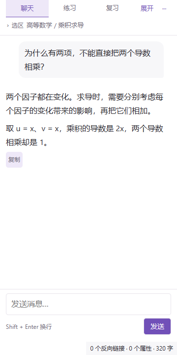

# 学习 · Study Companion

**基于 Obsidian 与 GPT 的个人大学学习插件：按学科积累笔记，不懂就问，用真实作答安排后续练习与复习。**

Obsidian 保存可以持续修改、链接和迁移的 Markdown 笔记；插件通过本机 Codex 的 ChatGPT 登录提供辅导。界面采用普通聊天模式，回答由使用者自行复制粘贴到笔记，不要求填写“我的理解”。

当前版本 **0.1.0 / 实验原型**，仅支持桌面端、单人使用。基础聊天与学习记录已实现；完整的长期个性化指导仍在规划中。



*预览使用自拟数学示例，不包含个人笔记或聊天记录。*

## 已实现

| 入口 | 当前能力 |
| --- | --- |
| 聊天 | 引用当前 Markdown 笔记或选区，连续追问、流式回答、停止生成、复制 Markdown |
| 练习 | 录入题干、来源、提示与参考解答；分步提示；先保留原始作答，再核对答案 |
| 复习 | 根据已有作答、提示使用和参考核对结果生成队列；支持时间预算、延期与提前练习 |

- **普通聊天体验**：用户消息靠右、回复靠左；Enter 发送，Shift+Enter 换行；中文输入法确认不会误发送。
- **阅读空间优先**：引用信息折叠为一行，输入框随内容增高；正文独立滚动，翻看历史时不强制跳回底部；自动避让 Obsidian 状态栏。
- **按学科组织**：笔记可用 `subject` 属性指定学科，否则使用第一层文件夹名。
- **上下文可确认**：切换笔记时提示仍在引用的资料，由使用者决定是否更新。
- **证据分开保存**：原始作答、提示使用、参考答案核对、模型反馈、自评和延期分别记录。
- **数据留在笔记库**：课程笔记、题库与学习事件使用 Markdown；聊天历史和输入草稿保存于插件本地数据。

## 学习方法与边界

学习过程围绕“提问 → 理解 → 独立尝试 → 核对 → 间隔后再检验”展开。初学者可以直接请求解释，不强迫先盲猜；是否真正掌握，需要另看作答证据。

当前复习采用透明的启发式规则：

- 未核对、作答有误，或借助提示完成的题目，通常隔一天再尝试。
- 未使用插件提示且对照参考答案核对正确时，在有时间间隔的情况下使用 `1、3、7、14、30` 天的复习间隔。
- 当天反复做对，不会连续提升复习阶段；延期不记为错误。
- 自评“懂了”和模型判断不直接提升复习阶段。
- 每题暂按约五分钟估算，以本次时间预算筛选任务。

这些规则尚未针对真实长期学习数据校准，不代表遗忘概率或经过验证的最优安排。“未使用插件提示”也不等于没有查阅其他资料。原题做熟后仍需新题、混合题型和延迟检验；目前插件不会自动生成这些迁移题。

## 与 Claudian 等通用助手的区别

[Claudian](https://github.com/YishenTu/claudian) 提供更完整的通用聊天、会话管理、文件引用、笔记编辑与工具调用能力，并支持 Claude Code、Codex 等后端。

本项目重点探索大学学习中的题目来源、作答证据和复习安排。当前聊天能力较基础，模型主要接收绑定笔记与近期对话，**尚未自动结合跨学科错题历史形成长期学习画像**。

后续会评估复用成熟聊天工具的能力，将自定义开发集中在学习记录与复习上。当前两个插件独立运行，本项目没有集成或依赖 Claudian。

## 安装与使用

### 1. 构建插件

建议使用 Node.js 24 LTS 与 npm。

```bash
git clone https://github.com/czm-mmm/vibeidea.git
cd vibeidea/projects/obsidian-study-companion
npm ci
npm run build
```

将 `dist/study-companion/` 中的三个文件复制到笔记库：

```text
你的笔记库/.obsidian/plugins/study-companion/
├── main.js
├── manifest.json
└── styles.css
```

也可以在 Windows PowerShell 中运行：

```powershell
./Install-Plugin.ps1 -VaultPath 'C:\StudyVault'
```

将示例路径换成自己的笔记库路径，并先用 Obsidian 打开过该目录。安装脚本会备份已有插件程序文件，保留 `data.json`，不自动改变插件启用状态。

在 Obsidian「设置 → 第三方插件」启用 **学习 · Study Companion**。使用左侧毕业帽图标，或命令面板中的「打开学习侧栏」。

### 2. 连接 ChatGPT / Codex

1. 安装官方 [Codex CLI](https://developers.openai.com/codex/cli/)，使用自己的 ChatGPT 账号登录。
2. 在学习面板右上角选择「··· → 连接 ChatGPT / Codex → 检查连接」。
3. 如果未自动找到 Codex，填写其可执行文件路径；模型留空时使用 Codex 默认设置。
4. 打开课程笔记，选中不懂的内容，用命令「围绕选区或当前笔记提问」，然后正常聊天。

本插件不要求填写 API Key，通过 Codex 的 ChatGPT 登录使用相应订阅权益。已有 Plus 用户可使用其包含的 Codex 额度，**这不是无限免费调用，也不提供 Claude 额度**；可用模型、额度与价格以 [OpenAI 官方说明](https://learn.chatgpt.com/docs/pricing)为准。

网络或额度不可用时，仍可查看笔记、录题和使用本地练习记录；更多菜单中支持复制问题与上下文到外部聊天工具，再手动粘贴回答。

### 3. 试用示例

[examples/大学学习库](examples/大学学习库) 包含高等数学、大学物理笔记与三道自拟题。将该目录作为 Obsidian 笔记库打开，安装并启用插件即可试用。

所有示例均注明“自拟”，没有冒充真题。录入自己的教材题或真题时，请保存教材页码、年份、题号及可靠参考解答。

## 题目与数据格式

每道题是一篇 Markdown，参见 [题目模板](templates/题目.md)：

```yaml
study_type: question
question_id: a-stable-unique-id
subject: 高等数学
topic: 导数
question_kind: 自拟题
source: 自拟示例
reserved: false
```

正文使用 `## 题目`、`## 提示 1`、`## 提示 2`、`## 参考解答`、`## 方法总结`。建议保留稳定的 `question_id`，避免文件改名后记录失联。`reserved: true` 仅排除日常推荐，不是加密或访问控制。

学习事件默认保存在 `学习记录/Study Companion/事件/年/月/`。同一提交失败重试复用事件编号，不重复计数，也不覆盖原始作答。

聊天历史与草稿保存在 `.obsidian/plugins/study-companion/data.json`；分享笔记库前，应自行检查是否包含不希望公开的聊天内容。

## 资料发送与当前限制

- 提问时会发送绑定笔记正文（最多 20,000 字符）、选区、当前问题和近期最多 16 条完整消息；旧对话不会全部传入模型。
- 不自动索引或上传整个笔记库。调用使用临时空目录，禁用工具调用，并拒绝客户端工具审批；这不是经过独立审计的文件读取硬隔离保证。
- 尚未实现图片作答、扫描真题 OCR、PDF 页码定位、多笔记检索、长期学习摘要或学习画像。
- 模型反馈需要核实；聊天问过某个知识点，不会自动记为“不会”。
- 已在 Windows / Obsidian 1.13.7 验证安装与基础连接；其他桌面系统以及完整长期学习流程仍需更多验证。没有移动端、多用户或后台复习通知。

## 后续改进

以下均为规划，尚未实现：

1. **资料引用**：`@笔记`、多资料选择、截图输入，回答附可追溯的出处。
2. **聊天管理**：新建与查找对话、按学科查看历史、编辑问题、重新生成、连接状态与错误恢复。
3. **个性化指导**：从实际作答生成可以检查和纠正的学习摘要，在后续解释中引用相关卡点。
4. **轻量录题与复习**：图片识别后核对题干和来源，再入库；支持新题与旧错题结合，减少人工操作。
5. **连续性与速度**：会话复用、按需取资料、长期摘要，以及快速解释／深入推导选项。
6. **减少重复开发**：评估与成熟聊天工具协作，通过 Markdown 数据衔接，保留可迁移的学习记录。

## 开发与验证

```bash
npm ci
npm test
npm run build
```

当前 23 项单元测试覆盖学习事件、复习安排、RPC 错误、停止与并发处理、事件幂等性及历史存储兼容性。

可选浏览器布局检查：

```bash
npm install --no-save --package-lock=false playwright
npx playwright install chromium
npm run test:layout
```

也可通过 `PLAYWRIGHT_PATH` 指定已有 Playwright 模块、通过 `EDGE_PATH` 指定已有 Edge 可执行文件。布局检查使用真实视图代码和模拟 Obsidian 宿主，覆盖三种宽度、四种缩放、三个入口共 36 组，并检查输入、复制、滚动与草稿保留。它不能替代真实 Obsidian 验证。

`scripts/check-codex.ts` 用于本机连接诊断；只有显式附加 `--ask` 才发送示例问题并消耗模型额度。

```text
src/core.ts       题目、学习事件、复习规则
src/codex.ts      Codex 连接与流式响应
src/storage.ts    笔记库读取与事件保存
src/main.ts       插件入口、配置、上下文管理
src/view.ts       聊天、练习、复习界面
src/layout.ts     状态栏避让与聊天滚动
tests/           单元测试与浏览器模拟宿主
examples/        自拟课程笔记与题目
```

## 许可

源代码遵循仓库的 [MIT License](../../LICENSE)。Obsidian、ChatGPT、Codex、Claude 等名称属于各自权利人；本项目为独立个人项目。
