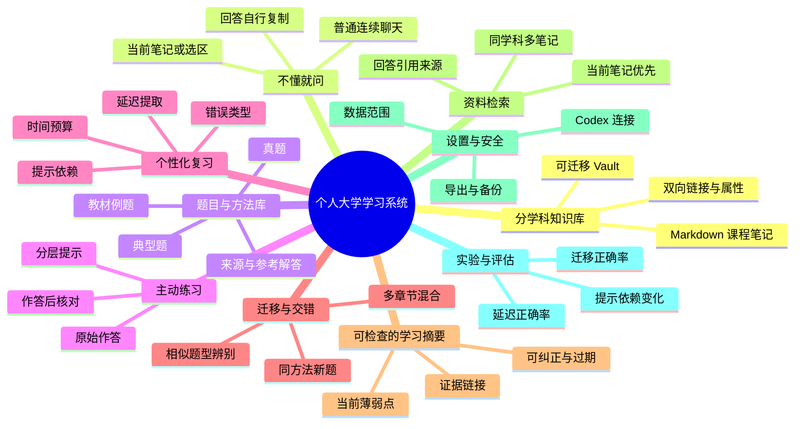

# 个人学习系统与项目长期上下文

> 本文是本项目的需求基线、学习方法说明和后续开发上下文。会话被压缩或重新开始时，应先读本文，再读 `README.md` 和当前代码；不要仅根据项目名称猜测功能。
>
> 必须严格区分“已经实现”“自动测试通过”“真实长期验证完成”。当前项目只是实验版，尚未经过真实课程中的长期使用、复习效果验证或公开用户测试，也未发布到 Obsidian Community Plugins。

## 信息来源边界

- 用户需求、界面取舍、功能范围和优先级，只总结本任务此前对话中已经确认的内容。
- 当前实现状态以本仓库代码、测试、README 和发布状态为准。
- 文末论文只用于核对前文已经采用的学习原则，不用于擅自增加产品需求。
- 本文中标为“规划”的内容不等于用户已经要求立即实现；后续实施前仍应结合用户最新要求确认范围。

## 一句话目标

以 Obsidian 作为长期可迁移的个人知识库，以 GPT 作为随时可追问的学习助手，以真实作答证据安排练习和复习，形成一个可持续、灵活、按学科组织、能从真题与典型题中积累方法的个人大学学习系统。

系统最终应帮助使用者做到四件事：

1. 课程笔记长期保存在自己掌控的 Markdown 文件中，并按学科持续生长。
2. 遇到不懂的定义、推导、图表或题目时，可以围绕当前笔记立即提问和连续追问。
3. 真题、教材例题、典型题和自己的原始作答被分开保存，逐步形成可追溯的方法库。
4. 复习依据延迟后的独立作答、提示使用和迁移题表现安排，而不是只依据“看懂了”或模型说“掌握了”。

## 不可丢失的用户要求

- 这是单人个人学习系统，不需要 Multi-User、账号管理或多人空间。
- Obsidian 是知识和学习记录的主存储；Markdown 文件应能脱离插件继续阅读、搜索、备份和迁移。
- 内容按学科组织，但目录和属性可以灵活调整，不能把所有课程强塞进同一种笔记流程。
- 允许“不懂就问”。初学阶段不强迫使用者先输出一段“我的理解”才允许提问。
- 聊天采用普通对话模式：用户消息靠右、助手回答靠左，使用者自行复制有价值的回答到笔记。
- 插件不自动把回答写进课程笔记，也不需要“记下我的理解”表单。
- 练习以真题、教材例题、典型题和可靠参考解答为核心；自拟题或 AI 生成题必须明确标注来源，不能伪装成真题。
- 复习必须参考真实学习行为，包括原始作答、是否查看提示、是否看过答案、延迟时间和后续迁移表现。
- 右侧栏保持简约实用，优先保证回答阅读面积；不在右下角堆叠低频按钮和说明文字。
- 适应 Obsidian 实际侧栏宽度、Windows 显示缩放和网页缩放，不能出现状态栏遮挡、文字重叠或输入区挤占大部分空间。
- 当前通过本机 Codex 的 ChatGPT 登录使用 Plus 所含额度，不依赖付费 API Key；额度不是无限的，也不包含 Claude 使用权。
- 数据和判断应可检查、可纠正、可导出，避免把学习画像做成不可解释的黑箱。

## 术语

- **Vault**：Obsidian 打开的知识库根文件夹。课程笔记、题库、附件和插件配置都位于这个文件夹内。
- **课程笔记**：围绕概念、定理、推导、实验、章节等形成的长期知识内容。
- **题目笔记**：一题一文件，保存题干、来源、提示、参考解答和方法总结。
- **学习事件**：一次作答、核对、提示使用、延期或自评的不可覆盖记录。
- **学习摘要**：从多次学习事件归纳出的可检查结论，例如“链式求导中经常漏乘内层导数”。它不是永久标签，必须能被新证据修正。
- **迁移题**：表面形式或情境不同，但需要调用同一原理、方法或判别能力的新题。

## 系统功能图



## 科学学习内核

### 1. 提取练习优先于重复阅读

真正能预测掌握程度的是在没有答案的情况下能否取回知识并完成任务。系统应把“合上笔记后解释、列步骤、推导或做题”作为主要证据；阅读、划线、收藏和聊天次数只能表示接触过，不能表示学会了。

产品含义：

- 聊天负责降低理解门槛，练习负责产生掌握证据，两者不能混为一谈。
- 看完回答后应有一次不看答案的短复述或题目尝试，但不强制塞进每次普通聊天。
- 模型评分和自我感觉不能直接提升复习阶段。

### 2. 间隔复习服务于长期保持

集中重复容易产生熟悉感，延迟后重新提取更能检验保持。复习间隔应随目标保持时间和真实表现调整，而不是机械追求每天连续打卡。

产品含义：

- 同一天连续做对同一题，不连续提高掌握阶段。
- 延迟后的独立正确比刚看完答案后的正确权重更高。
- 延期本身不等于遗忘或错误；重新出现时再用作答判断。

### 3. 初学者先看完整例题，再逐步撤去支架

在完全陌生的高负荷内容中，直接要求独立解决复杂题目可能只增加无效搜索。应先提供结构清楚的例题和关键决策理由，再从补步骤、只给提示过渡到独立完成。

推荐阶梯：

1. 完整例题：解释每一步做什么、为什么做、如何检查。
2. 补全部分步骤：让使用者完成关键变形或选择公式。
3. 只给方向性提示：不直接暴露答案。
4. 独立完成同类型题。
5. 在新表述、混合章节或真实题目中完成迁移。

### 4. 交错练习训练“识别该用什么方法”

按章节连续做同一题型时，题目顺序已经暗示了解法。基础步骤尚未形成时可以小规模集中练习；形成基本正确率后，应混入容易混淆的方法和旧章节，使使用者练习题型辨别。

产品含义：

- 复习队列不应只有同一道旧错题。
- 同一知识点至少需要原题、变式题和混合辨别题三种证据。
- 混合练习造成的即时正确率下降不一定是退步，应结合延迟表现判断。

### 5. 反馈必须针对作答过程

有效反馈应说明错误发生在哪里、为什么错、下一步如何修正，并保留原始作答。只给分数、鼓励语或完整答案容易掩盖具体卡点。

推荐反馈顺序：

1. 先复述使用者采用的思路，避免模型误判作答。
2. 标出第一个关键错误或缺口。
3. 给最小充分提示，允许再次尝试。
4. 尝试后再展示参考步骤与检查方法。
5. 记录错误类型，但把它视为可更新假设，不给人贴永久标签。

### 6. 掌握必须包含迁移和校准

会做原题可能只是记住答案。掌握至少要包含延迟后的独立提取，以及在新题中的方法选择。使用者的信心可以记录，用于发现“很有把握却做错”或“会做但没信心”的校准问题，但信心本身不是掌握证据。

## 适合本系统的完整学习循环


一次日常学习不必执行所有步骤。最小可持续流程是：

1. 打开正在学习的课程笔记，选中不懂的部分直接提问。
2. 如果目标是解决题目，先保存自己的原始尝试，再按需请求一层提示。
3. 核对答案时只记录第一个关键错误、正确方法和一个检查点。
4. 结束前安排一次延迟复习，不要求当天反复刷到全对。
5. 复习时混入至少一道表面不同的题，防止只记住原题步骤。

## 分学科的灵活处理

共同的数据骨架保持一致，但不同学科使用不同的掌握证据：

| 学科类型 | 主要笔记 | 更可靠的掌握证据 | 典型练习 |
| --- | --- | --- | --- |
| 数学、物理、电路 | 定义、推导、模型、条件 | 独立推导、列式、单位与边界检查、变式题 | 例题淡出、错因定位、跨章节混合 |
| 编程、信号处理 | 概念、算法、实验结果 | 不看答案实现、调试、解释复杂度、修改约束 | 小程序、故障诊断、代码阅读 |
| 记忆型课程 | 概念关系、时间线、对比表 | 自由回忆、简答、概念辨析 | 问答卡、空白纸回忆、累积测验 |
| 实验课程 | 原理、仪器、步骤、误差 | 预测结果、排查异常、解释误差来源 | 实验前预测、实验后复盘、数据解释 |

目录不必完全统一。只要求题目具有稳定 ID、来源明确，学习事件能关联到学科和题目。

## 推荐 Vault 结构

```text
大学学习库/
├─ 00 系统/
│  ├─ 学习说明.md
│  └─ 学科索引.md
├─ 高等数学/
├─ 大学物理/
├─ 电路分析/
├─ 程序设计/
├─ 学习题库/
│  ├─ 高等数学/
│  ├─ 大学物理/
│  └─ 其他学科/
├─ 学习记录/
│  └─ Study Companion/事件/年/月/
└─ 附件/
```

原则：

- 课程笔记放在学科目录，题目放在统一题库下的学科目录。
- 笔记可以通过 `subject` 属性明确学科；没有属性时可使用第一层文件夹名。
- 不建立过深的固定分类。主题变化时优先使用链接和属性，不频繁搬动大量文件。
- 附件与原始 PDF 可以保留，但题目笔记必须记录页码、年份、题号等可核查来源。

## 题目与学习证据

题目建议至少包含：

```yaml
study_type: question
question_id: stable-unique-id
subject: 高等数学
topic: 导数
question_kind: 教材例题 # 真题 / 教材例题 / 典型题 / 自拟题 / AI生成题
source: 教材名称、版本、页码或考试年份题号
reserved: false
```

正文保留 `题目`、分层提示、参考解答、方法总结。参考解答不是学习事件，不能覆盖自己的原始作答。

证据强度从高到低大致为：

1. 延迟后独立完成新的迁移题。
2. 延迟后独立完成原题或同类型题。
3. 当次独立完成并能解释关键决策。
4. 使用提示后完成。
5. 查看答案后复现。
6. 表示“懂了”、模型评价良好、阅读或聊天记录。

只有前几类证据适合提升掌握判断；最后一类只能帮助决定下一步怎么教。

## 复习算法

### 当前 0.1.2 已实现的透明规则

- 新题、未核对、作答错误或借助提示完成的题，通常较早再次出现。
- 未使用插件提示且对照参考答案核对正确时，在有真实时间间隔的情况下采用 `1、3、7、14、30` 天阶段。
- 当天重复正确不连续升级。
- 延期不记为答错。
- 自评和模型判断不直接升级。
- 每题暂按约 5 分钟，用用户设置的时间预算截取队列。

这些数字是可解释的初始启发规则，不是从个人数据训练出的最佳间隔，也不是精确遗忘概率。

### 后续应改进的方向

- 将事实记忆与复杂问题求解分开调度；二者不能共用完全相同的“记住/忘记”模型。
- 记录作答用时、提示层级、错误类型和题目是否为迁移题，但允许用户纠正记录。
- 复习队列同时包含到期旧题、当前课程新题和少量混合迁移题，比例根据时间预算和近期表现调整。
- 一个方法至少在两个不同日期独立正确，并通过一道变式题后，才进入较长间隔。
- 数据量足够前保持简单透明；不要用看似精确的 AI 分数替代真实结果。

## GPT 导师行为

普通聊天模式应直接回答问题，同时遵循以下偏好：

- 优先使用当前笔记、选区和题目来源，不假装看过未提供的资料。
- 先判断使用者是在问概念、推导、题目、实验还是复习建议，再选择回答形式。
- 对新概念给直观解释、正式定义、最小例子和常见反例；不过度堆砌术语。
- 对题目默认先帮助定位和给最小提示。使用者明确要求完整解答时可以给出，但应标明关键决策点。
- 对真题和教材内容保留出处；来源不明时明确说“来源未核实”。
- 将事实、推断和建议分开表达；不确定时说明不确定性。
- 不因一次聊天就写入“不会某知识点”的长期画像。
- 个性化内容应引用相应学习事件，例如“过去两次延迟作答都漏了单位换算”，并允许删除或纠正。

## 界面与视觉要求

目标形态是 Obsidian 右侧栏中的普通聊天，而不是表单式学习仪表盘。

- 顶部只保留聊天、练习、复习三个主入口和低频更多菜单。
- 当前引用折叠成一行，需要时再展开。
- 中间消息区使用剩余高度，回答阅读区应明显大于输入和控制区。
- 用户消息靠右、助手回答靠左，代码、公式和长段落可以正常滚动与复制。
- 输入框从单行开始，随内容增高至上限；Enter 发送、Shift+Enter 换行，中文输入法确认不得误发送。
- 浏览历史时不强制跳到底部；只有用户原本位于底部时才跟随流式输出。
- 自动避开 Obsidian 状态栏，不在右下角重复放置说明、按钮或状态文字。
- 支持窄侧栏、宽侧栏和常用缩放比例；低频功能收进菜单，不通过缩小正文字号换空间。
- 保持键盘焦点、草稿和不同入口的滚动位置。

## 技术架构

### 当前实现

```text
Obsidian Vault
├─ 课程笔记与题目 Markdown
├─ 学习记录/Study Companion/事件/...   # 可检查的学习事件
└─ .obsidian/plugins/study-companion/
   ├─ main.js
   ├─ manifest.json
   ├─ styles.css
   └─ data.json                         # 设置、聊天历史与草稿

Study Companion
├─ src/main.ts      插件入口、设置和上下文管理
├─ src/view.ts      聊天、练习、复习界面
├─ src/core.ts      题目解析、事件和复习规则
├─ src/storage.ts   Vault 读取与事件写入
├─ src/codex.ts     本机 Codex JSONL RPC 与流式回答
└─ src/layout.ts    状态栏避让和滚动策略
```

提问时自动选择资料范围：问候不附带笔记；存在选区时优先发送最多 8,000 字符的选区；普通问题从当前笔记提取最多 8,000 字符的相关片段；明确要求总结全文时才发送最多 20,000 字符。首次建立线程时最多恢复近期 8 条消息、每条最多 4,000 字符；同一笔记会话的后续提问复用线程，不重复附带这段历史。当前不会索引或自动上传整个 Vault。

Codex 连接使用本机 ChatGPT 登录与订阅额度，不要求 API Key。回答模式固定为两档：快速使用 GPT-5.6 Luna `max`，深入使用 GPT-5.6 Sol `high`。Obsidian 启动、切换笔记、更新选区或切换模式后，会在后台连接 Codex、读取模型列表并提前创建当前笔记线程。调用采用临时空目录、只读沙箱并拒绝客户端工具审批；这降低了无关文件访问风险，但不应宣称已经过独立安全审计或形成绝对隔离。

### 规划中的检索与记忆

多笔记检索应按以下顺序逐步实现：

1. 当前笔记和选区，始终由用户明确看到。
2. 用户选择的同学科笔记。
3. 同学科关键词检索，可先用本地全文/BM25，不急于引入向量数据库。
4. 需要语义召回时增加可选嵌入索引，并显示命中的文件和片段。
5. 回答附 Obsidian 文件链接或来源列表，允许用户移除错误上下文。

长期记忆不保存抽象人格标签，而保存有证据、会过期的学习摘要。摘要建议使用 Markdown 或可导出的 JSON，并记录生成日期、证据事件和置信范围。

## 当前项目状态（2026-09-09）

### 已实现并通过自动检查

- 当前笔记或选区聊天、连续追问、流式回答、停止和复制 Markdown。
- Codex 后台连接并预创建当前笔记线程、同一笔记会话的线程复用、按问题选择资料范围，以及连接／思考／生成状态提示。
- 固定的快速（GPT-5.6 Luna `max`）和深入（GPT-5.6 Sol `high`）模式；从本机 Codex 读取模型列表并验证这两组配置。
- 普通聊天布局及状态栏避让。
- 题目录入、分层提示、原始作答与核对记录。
- 初版复习队列、时间预算、延期和提前练习。
- Markdown 学习事件以及插件本地聊天历史。
- 28 项单元测试、构建检查、36 组侧栏布局与交互检查。
- GitHub `v0.1.0` 实验性预发布和手动安装包。

### 已做有限验证

- Windows 与 Obsidian 1.13.7 下完成安装、基础连接和界面检查。
- 使用 ChatGPT Plus 登录的本机 Codex 完成不含个人笔记的连接和模型列表测试；当前返回 6 个模型及各自支持的推理强度。
- 以上结果只证明基础技术链路可用，不证明长期学习效果。

### 尚未实现或尚未验证

- 真实课程中的数周或数月连续使用。
- 长期复习效果、迁移效果和个性化摘要准确性评估。
- 跨多笔记检索、可引用 RAG、长期学习画像。
- 图片作答、扫描真题 OCR、PDF 页码定位和题目自动入库。
- 完整聊天管理、会话查找、编辑问题和重新生成。
- macOS、Linux、移动端验证。
- Obsidian Community Plugins 发布。

项目仓库目前为私有仓库。GitHub Release 是手动安装渠道，不等于 Obsidian 市场发布。

## 开发优先级

### P0：先证明学习闭环可靠

1. 用真实但可备份的课程资料连续试用 2–4 周。
2. 检查事件记录是否准确、是否重复、题目改名后是否失联。
3. 增加导出、备份和数据格式迁移机制。
4. 记录延迟正确率、提示依赖和迁移题结果，验证复习队列是否有用。

### P1：降低日常操作成本

1. 快速从当前笔记或截图建立题目草稿，由用户核对来源后入库。
2. 支持选择同学科多篇笔记并显示引用来源。
3. 增加按学科查找聊天和题目的轻量入口。
4. 从学习事件生成可检查、可纠正、会过期的学习摘要。

### P2：提升个性化与迁移

1. 根据常见错误推荐提示层级，而不是直接给完整答案。
2. 在复习中加入相似题型辨别、变式题和跨章节混合。
3. 用真实纵向数据校准间隔，比较简单规则与更复杂调度是否真的改善结果。

### 暂不优先

- Multi-User、团队空间和复杂权限系统。
- 自动替用户改写整篇笔记。
- 华丽仪表盘、积分、连续打卡和过度游戏化。
- 自动上传整个 Vault。
- 在没有真实数据前建立复杂的黑箱能力分数。

## 如何评价系统是否有效

不要用聊天次数、笔记数量或当场正确率作为主要成功指标。优先观察：

- 延迟 1 天、1 周后的独立正确率。
- 新表述或新情境中的迁移正确率。
- 完成同类题所需提示层级是否下降。
- 高信心错误是否减少，信心与真实正确率是否更匹配。
- 在固定时间预算内，到期任务是否可完成，积压是否可控。
- 使用者是否仍愿意持续记录，而不是因流程太重放弃。

任何复习算法改动至少应比较改动前后的上述指标，并保留退出或手动调整方式。

## 后续协作规则

以后继续设计或开发时遵循以下规则：

1. 先读本文，再检查仓库状态、`README.md`、`CHANGELOG.md` 和相关代码。
2. 用户最新明确要求优先；发生长期需求变化时同步更新本文。
3. 报告功能时标注“已实现”“自动测试”“真实验证”“规划”，不得混用。
4. 不擅自加入 Multi-User、强制理解表单、自动写笔记或右下角冗余控件。
5. 修改复习逻辑时先说明依据、证据字段和失败方式，再实现算法。
6. 修改 UI 时验证窄宽度、缩放、中文输入法、长回答、流式滚动和状态栏遮挡。
7. 不把个人 Vault 路径、`data.json`、聊天内容、真实作答或未脱敏截图提交到 GitHub。
8. 正式源码以本仓库为准；构建产物安装到 Vault，不在其他目录维护第二份源码。

## 学习科学参考

- Dunlosky et al. (2013), *Improving Students' Learning With Effective Learning Techniques*. [DOI: 10.1177/1529100612453266](https://doi.org/10.1177/1529100612453266)
- Roediger & Karpicke (2006), *Test-Enhanced Learning: Taking Memory Tests Improves Long-Term Retention*. [DOI: 10.1111/j.1467-9280.2006.01693.x](https://doi.org/10.1111/j.1467-9280.2006.01693.x)
- Cepeda et al. (2006), *Distributed Practice in Verbal Recall Tasks: A Review and Quantitative Synthesis*. [DOI: 10.1037/0033-2909.132.3.354](https://doi.org/10.1037/0033-2909.132.3.354)
- Karpicke & Blunt (2011), *Retrieval Practice Produces More Learning Than Elaborative Studying With Concept Mapping*. [DOI: 10.1126/science.1199327](https://doi.org/10.1126/science.1199327)
- Butler (2010), *Repeated Testing Produces Superior Transfer of Learning Relative to Repeated Studying*. [DOI: 10.1037/a0019902](https://doi.org/10.1037/a0019902)
- Rohrer & Taylor (2007), *The Shuffling of Mathematics Problems Improves Learning*. [DOI: 10.1007/s11251-007-9015-8](https://doi.org/10.1007/s11251-007-9015-8)
- Shute (2008), *Focus on Formative Feedback*. [DOI: 10.3102/0034654307313795](https://doi.org/10.3102/0034654307313795)

这些研究支持提取练习、间隔、反馈和适当交错等总体方向，但不能直接证明本插件当前的具体间隔数字、界面或个性化规则有效。项目仍需要真实纵向数据验证。
